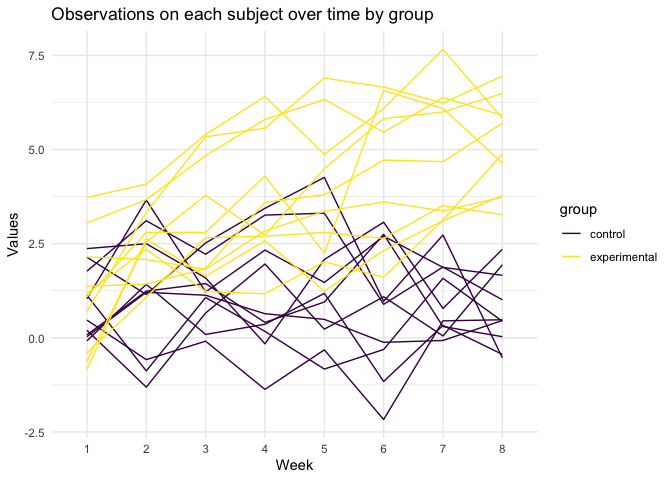

hw5
================
Stephen Powers
11/8/2019

## Problem 1

``` r
set.seed(10)

iris_with_missing = iris %>% 
  map_df(~replace(.x, sample(1:150, 20), NA)) %>%
  mutate(Species = as.character(Species))
```

``` r
fill_missing = function(x) {
  if (is.numeric(x)) 
    {replace_na(x, mean(x, na.rm = TRUE))} 
  else if (is.character(x)) 
    {replace_na(x, "virginica")}}

iris_fill = map_df(iris_with_missing, fill_missing)
```

## Problem 2

``` r
p2_data = 
  list.files("./data/", pattern = ".csv", full.names = TRUE) %>% view
```

#### Tidy Up

``` r
p2_tidy_data = 
  p2_data %>% map_df(read.csv) %>% 
  mutate(id = tools::file_path_sans_ext(basename(p2_data))) %>% 
  separate(id, into = c("group", "id_number"), sep = "_") %>% 
  mutate(group = recode(group, "con" = "control", "exp" = "experimental")) %>% 
  mutate(observation = row_number()) %>%
  select(observation, group, id_number, everything()) %>% 
  pivot_longer(week_1:week_8,
    names_to = "week",
    values_to = "value",
    names_prefix = "week_") %>% view
```

#### Spaghetti Plot

``` r
p2_tidy_data %>% 
  ggplot(aes(x = week, y = value, color = group, group = observation)) +
  geom_line() +
  scale_color_viridis(discrete = TRUE) +
  theme_minimal() +
  ggtitle("Observations on each subject over time by group") +
  xlab("Week") +
  ylab("Values") 
```

<!-- -->

## Problem 3

#### Creating Model

``` r
sim_regression = function(n = 30, beta0 = 2, beta1) {
  
  sim_data = tibble(
    x = rnorm(n, mean = 0, sd = 1),
    y = beta0 + beta1*x + rnorm(n, mean = 0, sd = sqrt(50)))
  
  ls_fit = lm(y ~ x, data = sim_data)
  
  tibble(
    b1_estimate = broom::tidy(ls_fit)[2, 2] %>% 
      as.numeric(),
    p_value = broom::tidy(ls_fit)[2, 5] %>% 
      as.numeric())
}
```

#### Generate 10000 datasets from the model
